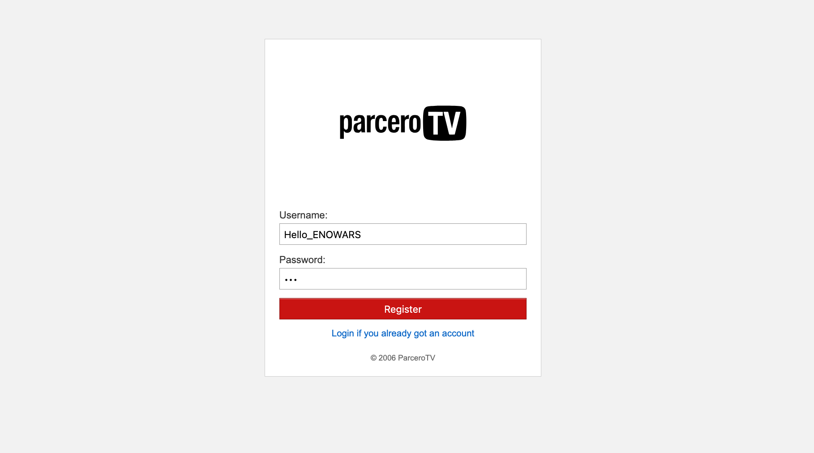
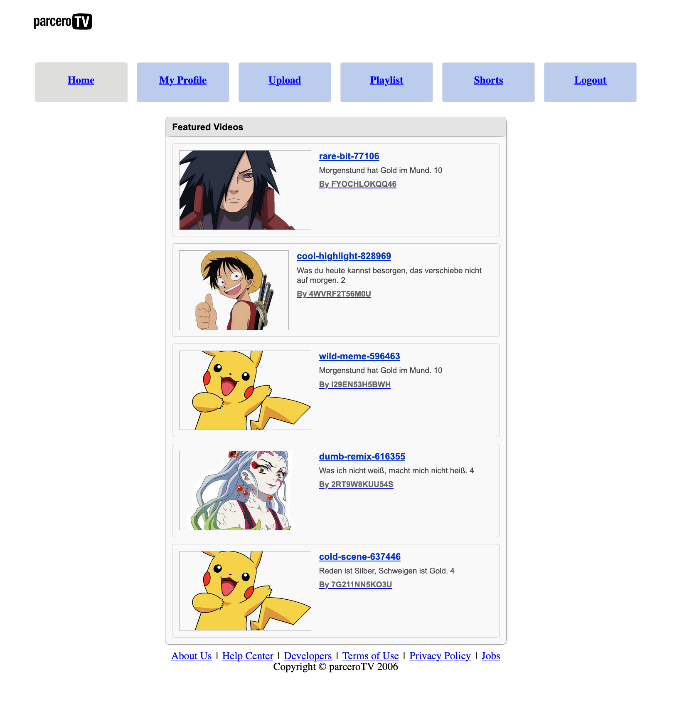
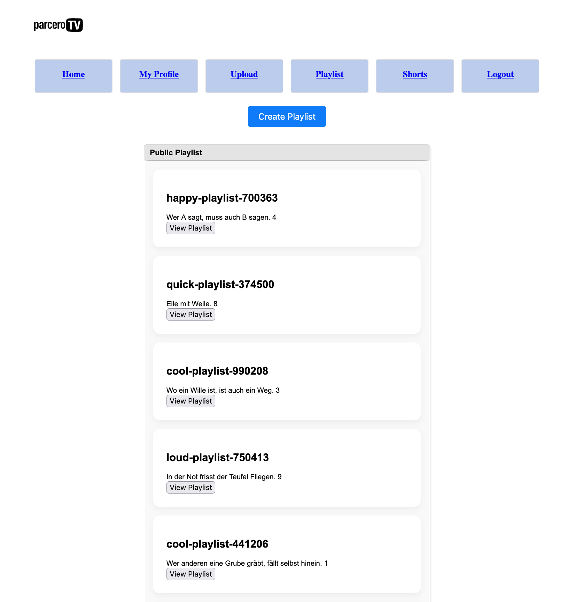
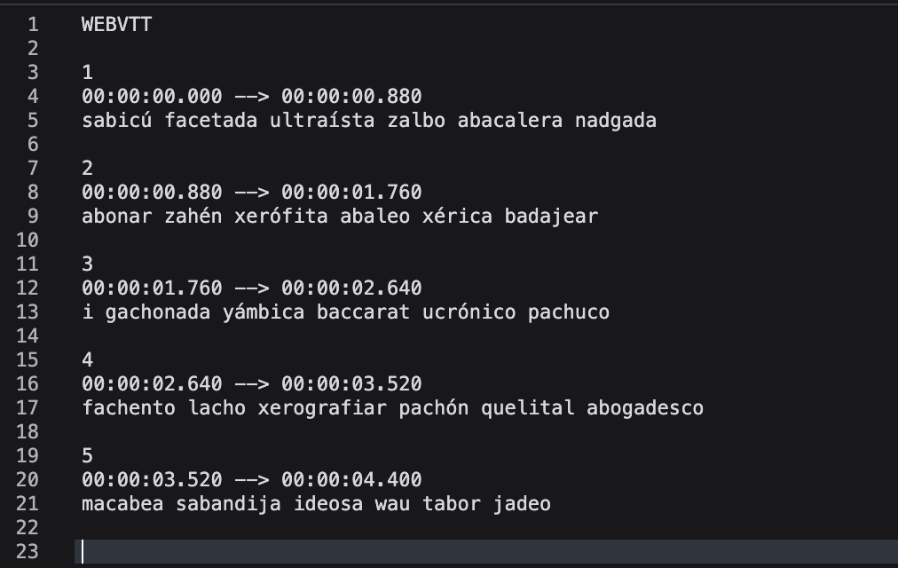

## ENOWARS9 ParceroTV Documentation
- [Introduction](https://github.com/enowars/enowars9-service-parceroTV/tree/main/documentation#introduction)
- [Installation](https://github.com/enowars/enowars9-service-parceroTV/tree/main/documentation#installation)
- [Functionality](https://github.com/enowars/enowars9-service-parceroTV/tree/main/documentation#functionality)
- [Vulnerabilities](https://github.com/enowars/enowars9-service-parceroTV/tree/main/documentation#Vulnerabilities)
- [Stats](https://github.com/enowars/enowars9-service-parceroTV/tree/main/documentation#stats)

## Introduction
ParceroTV is a YouTube clone. It was developed with Rust (Actix Web Framework) + Sqlite and HTML/CSS/JS. On ParceroTV, users can upload, comment and watch videos, have a profile description. Create and share playlists and also upload and watch Shorts (or Reels) with captions.

The service was developed and played in ENOWARS9 and includes 2 vulnerabilities.

## Installation
The application includes the checker and the service. The ENOENGINE interacts with the checker which is responsible for interacting with the service. This includes storing and retrieving the flags, creating and retrieving noise as well as havoc.

### Running the Checker

```
git clone https://github.com/enowars/enowars9-service-parceroTV.git
cd enowars9-service-parceroTV
cd checker
docker compose up --build -d
```

### Running the service

```
git clone https://github.com/enowars/enowars9-service-parceroTV.git
cd enowars9-service-parceroTV
cd service
docker compose up --build -d
```

## Functionality
Overview of all the functionality that the service provides for users.
### Ports
**Service Port:** 7777
**Checker Port:** 17777

### Creating an Account
On /register users can create Accounts.


Afterwards, they can log In and have a Session that has a Lifetime of 15 minutes on /login.
Users will be redirected to the homepage where they first will see all the public videos that are available on ParceroTV.


### Watching and Commenting / Liking Videos
When clicking on a video on the Homepage users will be redirected to the the video page. There they can watch, like or dislike 
and comment the video. They also will see comments of other users and the total like/dislike count.


### User Profile
When clicking on **My Profile** users will get to their profile page. Here they can update their description, and also see their public and private videos.

When Clicking on the name of a user, it is possible to see which is the description of this user and what videos was uploaded by this person.


### Uploading Videos
Of course it is possible to upload videos, to do this users can go to the upload section via the navbar.  
Users will fill out the form and can then decide if the video should be public or private. A private video can only be accessed by the user that upload this video.


### Creating Playlists
Users can also create and share playlists with other users. Each Playlists contains a set of videos. If the playlist is private users should select all the users that should be able to see the videos provided in this playlists, otherwise the access will be denied.


So playlists are only available to users if they are public or the user has the access right.


### Shorts
Another main functionality is watching and uploading shorts.
Shorts will have a endless scroll option, when all shorts that are available was watched by a user they will start from the beginning.


When Uploading a short users can provide subtitles/captions that are displayed together with the video that they provided.
They also have the possibility to 'translate to spanish' but this translation is gibberish, and doesn't make sense.

### Misc
There are also a variety of links to different html files that provide a complete look to the service but doesnt provide any further use for users.
These are the links in the footer
- About Us
- Help Center
- Developers
- Terms of Use
- Privacy Policy
- Jobs

## Vulnerabilities
### Flagstores
1. Video description of a private video
2. Original Captions/Subtitles of a short that was translated to 'spanish'


## Vulnerability and Exploit of Video description of a private video (Hash Collision)
**Overview:**  
An logic error occurs where video information is accessed via the path and not the unique videoID.
A video path is generated by the encoded metadata of a video.
Exploit is not replayable.
### Steps to exploit
1. Notice that the video information is accessed via the path.
Frontend (videos.js):
``` async function getVideoInfo(path) {
        try {
            const res = await fetch("/get_video_info/" + path);
            const videoInfo = await res.json();
    ...
```
Backend (db.rs):  
Looking at the select_video_by_path function, we see that the query looks like this:  
`"SELECT VideoId, name, description, thumbnail_path, path, is_private, location, userId, likes, dislikes, clicks FROM videos WHERE path = (?1) ORDER BY videoID LIMIT 1;`  
Therefore if two videos have the same path, only the first one (ordered by videoID) will be shown.

2. Spot the logic error in the permission check looking at the /get_video_info endpoint:  
Inside the user_has_permission (db.rs) function is called, to check if a user has access to a video.  
The query looks like this `SELECT userID FROM videos WHERE userID = ?1 AND path = ?2;`  
So the permission is checked by ownership and path, but it should be checked by videoID.

3. Understand the path creation:
Inside the upload procedure the get_path function is called, which will generate a path where the video will be stored.
```
pub fn get_path(is_private: u32, title: &str, file: &NamedTempFile) -> String {
    
    let mut path = String::from("");
    if is_private == 1 {
        path.push_str("private/");
    }
    else {
        path.push_str("videos/");
    }
    path.push_str(sanitize_title(title, true));
    let md = read_metadata(title, file);
    path.push_str(&calculate_hash(&md).to_string());
    path.push_str(".mp4");
    path
}
```
> We see that a hash is calculated by the metadata of the video.  
> Taking a closer look at read_metadata (lib.rs) we see this part of the function
```
match ffmpeg::format::input(path) {
        Ok(context) => {
            for (k, v) in context.metadata().iter() {
                match k.to_lowercase().as_str() {
                    "title" => title_override = v.to_string(),
                    "artist" => creator = v.to_string(),
                    "genre" => genre = v.to_string(),
                    _ => {},
                }
            }
        }
        Err(_) => {
        }
    }
```
>So wee see that the hash is calculated like that.  
>`h(title, artist, genre) = hash`

4. Craft a video with the right metadata:  
For the actual exploit we need to find out a way to encode the metadata in the video.  
The data we need to encode is leaked in the profile of the user that will be exploited (attack.json).  
Using ffmpeg we can use this command to encode the metadata:  
`ffmpeg -i input.mp4 -metadata title="Leaked_title" -metadata artist="username" -metadata genre="leaked_genre" output.mp4`  
Last but not least we upload the video with the right title and have now access to the videoinfo (description) of the private video from the hacked user.

### How to FIX
There are a few ways to fix this issue. First one could change the way of getting the videoinfo by writing a query that relies on the videoID to garantee uniqueness.  
Or one could change the generation of the hash to actually garantee a unique path that is not replicable.

## Vulnerability and Exploit of Captions that were translated to 'spanish' 
**Overview:**  
This vulnerability lives in the translation of shorts. When translating to 'spanish' it should not be possible to get the original subtitles back, as it is supposed to be a 'random' gibberish translation.
Exploit is not replayable.

### Steps to exploit
1. Understand how subtitles are created:  
Look at spanish_dictionary.rs and understand how the SPANISH_WORDS array is build. It loads all words from spanish_words.txt, groups them by first letter, then takes up to 4096/26 unique words from each letter bucket, filling any remaining slots with other unused words.  
Looking at the translate_to_spanish function, we see that first a bytestream is created. This bytestream is created with a deterministic ChaCha20 RNG that was seeded from the video duration, each input byte is then XORed with the next random byte from the RNG.  
It then groups the transformed bytes into 12 bit values, each 12 bit value is used as index in the array SPANISH_WORDS. If there are leftover bits that don’t make a full 12-bit chunk, it pads them with zeros on the right, extracts the 12-bit value, and adds the corresponding word from SPANISH_WORDS to the list. Each word is space seperated and will then be used for the VTT, which will look something like this.

2. Reverse the subtitle creation:
This is the actual exploit which basically is reversing the steps of the creation. 
First reconstruct the SPANISH_WORDS array.  
Second extract only the words from the WEBVTT as timestamps are not needed.  
Third get the corresponding indices of the array from the words.
Fourth unpack the indices to get the bytes. To do so take the list of 12-bit indices, pack them into a bitstream and extract 8 bits at a time, if there is any padding with 0 at the end remove it.  
Fifth XOR the extracted bytes again with the same ChaCha20 RNG. To do so find out the video duration to recreate the same seed.  
Voila now we have the original bytes (the flag).

### How to Fix
There are a few requirements from the checker for the translation functionality. The functionality cant just be removed. All words that are in a WEBVTT have to be in the SPANISH_WORDS array when translating. The same input should lead to the same translation when uploading to different shorts (but still being the same video). Different input texts should also create different output translations.  
The most straightforward and effective fix is to make the seed unpredictable. Instead of basing it on something guessable like the media duration which lets others reproduce the output use a source of randomness that’s both secure and unique for each case. This could mean pulling from cryptographically strong random data, so nobody else can realistically figure out or recreate the mapping, while still keeping the same input mapped to the same output under the same secret seed.

### Notes
Ideally, the concept of the translation depending on the video duration should also have been tested by the checker, but due to performance concerns, this was dropped.

## Stats
112 Teams played the CTF
- Flagstore 1: Exploited by 24 Teams, first blood in round 56
- Flagstore 2: Exploited by 25 Teams, first blood in round 74


